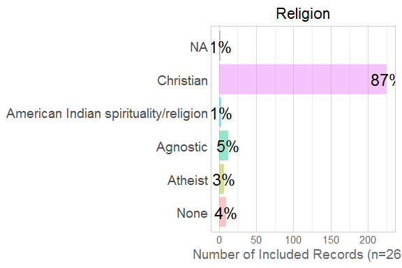
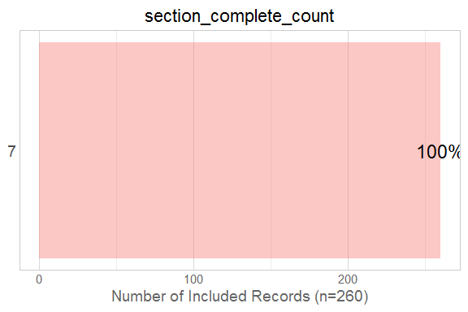
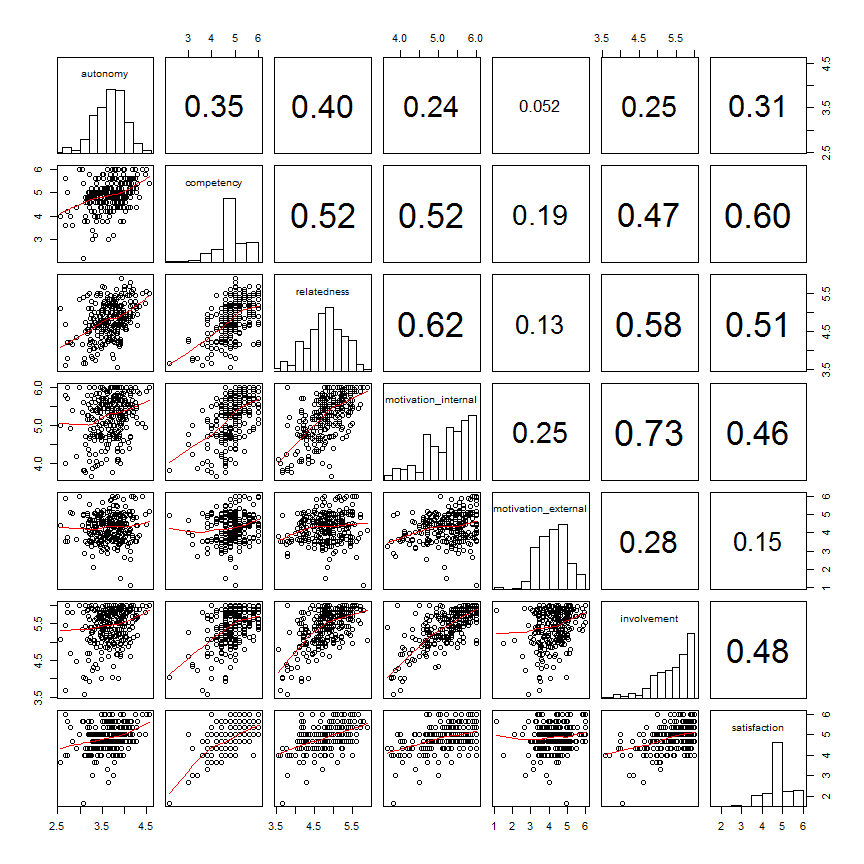

# EDA of Scales

<!--  Set the working directory to the repository's base directory; this assumes the report is nested inside of three directories.-->


<!-- Set the report-wide options, and point to the external code file. -->


<!-- Load the sources.  Suppress the output when loading sources. -->


<!-- Load 'sourced' R files.  Suppress the output when loading packages. -->


<!-- Load any global functions and variables declared in the R file.  Suppress the output. -->


<!-- Declare any global functions specific to a Rmd output.  Suppress the output. -->


<!-- Load the datasets. -->


<!-- Tweak the datasets. -->


# Summary

### Notes

### Unanswered questions


# Moments

```r
summary(ds) #Mean and quartiles
```

```
  response_id     one_child_at_least live_with_child    sexual_orientation
 Min.   :  9.00   Mode:logical       Min.   :1       Heterosexual:257     
 1st Qu.: 83.75   TRUE:260           1st Qu.:1       Homosexual  :  2     
 Median :184.50   NA's:0             Median :1       Bisexual    :  1     
 Mean   :188.28                      Mean   :1                            
 3rd Qu.:292.50                      3rd Qu.:1                            
 Max.   :404.00                      Max.   :1                            
                                                                          
 live_with_mother is_married        married_duration
 Mode :logical    Mode:logical   0-1 year   :  2    
 FALSE:6          TRUE:260       1-5 years  :  8    
 TRUE :254        NA's:0         6-10 years : 63    
 NA's :0                         11-15 years:110    
                                 16-20 years: 55    
                                 20+years   : 21    
                                 NA's       :  1    
                         education            age     
 High school diploma or GED   : 19   18-25      :  0  
 Vocational-Technical Training:  7   26-40      :167  
 Associates Degree            : 17   41-55      : 88  
 College Graduate             :104   56 or older:  4  
 Graduate School              :113   NA's       :  1  
                                                      
                                                      
           income_category child_in_home_count              race    
 Less than $24,999 :  1    1        : 26       Black          :  4  
 $25,000 to $49,999: 22    2        :124       Caucasian      :229  
 $50,000 to $99,999: 90    3        : 72       Asian-American :  5  
 $100,000          :145    4 or more: 38       American Indian: 10  
 NA's              :  2                        Hispanic       :  4  
                                               Other          :  7  
                                               NA's           :  1  
                                  religion   work_hours_outside
 Christian                            :225   0    :  4         
 Agnostic                             : 13   1-20 : 12         
 None                                 : 10   21-40: 74         
 Atheist                              :  7   40+  :169         
 American Indian spirituality/religion:  3   NA's :  1         
 (Other)                              :  0                     
 NA's                                 :  2                     
 work_hours_spouse_outside section_complete_count    autonomy    
 0    :77                  Min.   :7              Min.   :2.562  
 1-20 :55                  1st Qu.:7              1st Qu.:3.458  
 21-40:74                  Median :7              Median :3.708  
 40+  :53                  Mean   :7              Mean   :3.674  
 NA's : 1                  3rd Qu.:7              3rd Qu.:3.917  
                           Max.   :7              Max.   :4.562  
                                                                 
   competency     involvement    motivation_external motivation_internal
 Min.   :2.200   Min.   :3.577   Min.   :1.111       Min.   :3.667      
 1st Qu.:4.600   1st Qu.:5.115   1st Qu.:3.667       1st Qu.:4.833      
 Median :5.000   Median :5.538   Median :4.389       Median :5.333      
 Mean   :4.887   Mean   :5.413   Mean   :4.292       Mean   :5.236      
 3rd Qu.:5.200   3rd Qu.:5.808   3rd Qu.:4.844       3rd Qu.:5.667      
 Max.   :6.000   Max.   :6.000   Max.   :6.000       Max.   :6.000      
                                                                        
  relatedness     satisfaction  
 Min.   :3.550   Min.   :1.667  
 1st Qu.:4.500   1st Qu.:4.667  
 Median :4.850   Median :5.000  
 Mean   :4.813   Mean   :4.855  
 3rd Qu.:5.150   3rd Qu.:5.333  
 Max.   :5.900   Max.   :6.000  
                                
```

```r
sapply(ds, sd) #Standard Deviation
```

```
Warning in var(if (is.vector(x) || is.factor(x)) x else as.double(x), na.rm = na.rm): Calling var(x) on a factor x is deprecated and will become an error.
  Use something like 'all(duplicated(x)[-1L])' to test for a constant vector.

Warning in var(if (is.vector(x) || is.factor(x)) x else as.double(x), na.rm = na.rm): Calling var(x) on a factor x is deprecated and will become an error.
  Use something like 'all(duplicated(x)[-1L])' to test for a constant vector.

Warning in var(if (is.vector(x) || is.factor(x)) x else as.double(x), na.rm = na.rm): Calling var(x) on a factor x is deprecated and will become an error.
  Use something like 'all(duplicated(x)[-1L])' to test for a constant vector.

Warning in var(if (is.vector(x) || is.factor(x)) x else as.double(x), na.rm = na.rm): Calling var(x) on a factor x is deprecated and will become an error.
  Use something like 'all(duplicated(x)[-1L])' to test for a constant vector.

Warning in var(if (is.vector(x) || is.factor(x)) x else as.double(x), na.rm = na.rm): Calling var(x) on a factor x is deprecated and will become an error.
  Use something like 'all(duplicated(x)[-1L])' to test for a constant vector.

Warning in var(if (is.vector(x) || is.factor(x)) x else as.double(x), na.rm = na.rm): Calling var(x) on a factor x is deprecated and will become an error.
  Use something like 'all(duplicated(x)[-1L])' to test for a constant vector.

Warning in var(if (is.vector(x) || is.factor(x)) x else as.double(x), na.rm = na.rm): Calling var(x) on a factor x is deprecated and will become an error.
  Use something like 'all(duplicated(x)[-1L])' to test for a constant vector.

Warning in var(if (is.vector(x) || is.factor(x)) x else as.double(x), na.rm = na.rm): Calling var(x) on a factor x is deprecated and will become an error.
  Use something like 'all(duplicated(x)[-1L])' to test for a constant vector.

Warning in var(if (is.vector(x) || is.factor(x)) x else as.double(x), na.rm = na.rm): Calling var(x) on a factor x is deprecated and will become an error.
  Use something like 'all(duplicated(x)[-1L])' to test for a constant vector.

Warning in var(if (is.vector(x) || is.factor(x)) x else as.double(x), na.rm = na.rm): Calling var(x) on a factor x is deprecated and will become an error.
  Use something like 'all(duplicated(x)[-1L])' to test for a constant vector.
```

```
              response_id        one_child_at_least 
              113.8689903                 0.0000000 
          live_with_child        sexual_orientation 
                0.0000000                 0.1514213 
         live_with_mother                is_married 
                0.1504374                 0.0000000 
         married_duration                 education 
                       NA                 1.1229377 
                      age           income_category 
                       NA                        NA 
      child_in_home_count                      race 
                0.8626838                        NA 
                 religion        work_hours_outside 
                       NA                        NA 
work_hours_spouse_outside    section_complete_count 
                       NA                 0.0000000 
                 autonomy                competency 
                0.3520898                 0.5985682 
              involvement       motivation_external 
                0.4966607                 0.7868635 
      motivation_internal               relatedness 
                0.5738603                 0.4735373 
             satisfaction 
                0.6073652 
```

```r
sapply(ds, e1071::skewness, na.rm=T) #Skew (0 signifies symmetry)
```

```
Warning in mean.default(x): argument is not numeric or logical: returning
NA
```

```
Warning in Ops.factor(x, mean(x)): '-' not meaningful for factors
```

```
Warning in mean.default(x): argument is not numeric or logical: returning
NA
```

```
Warning in Ops.factor(x, mean(x)): '-' not meaningful for factors
```

```
Warning in mean.default(x): argument is not numeric or logical: returning
NA
```

```
Warning in Ops.factor(x, mean(x)): '-' not meaningful for factors
```

```
Warning in mean.default(x): argument is not numeric or logical: returning
NA
```

```
Warning in Ops.factor(x, mean(x)): '-' not meaningful for factors
```

```
Warning in mean.default(x): argument is not numeric or logical: returning
NA
```

```
Warning in Ops.factor(x, mean(x)): '-' not meaningful for factors
```

```
Warning in mean.default(x): argument is not numeric or logical: returning
NA
```

```
Warning in Ops.factor(x, mean(x)): '-' not meaningful for factors
```

```
Warning in mean.default(x): argument is not numeric or logical: returning
NA
```

```
Warning in Ops.factor(x, mean(x)): '-' not meaningful for factors
```

```
Warning in mean.default(x): argument is not numeric or logical: returning
NA
```

```
Warning in Ops.factor(x, mean(x)): '-' not meaningful for factors
```

```
Warning in mean.default(x): argument is not numeric or logical: returning
NA
```

```
Warning in Ops.factor(x, mean(x)): '-' not meaningful for factors
```

```
Warning in mean.default(x): argument is not numeric or logical: returning
NA
```

```
Warning in Ops.factor(x, mean(x)): '-' not meaningful for factors
```

```
              response_id        one_child_at_least 
                0.1158917                       NaN 
          live_with_child        sexual_orientation 
                      NaN                        NA 
         live_with_mother                is_married 
               -6.3160974                       NaN 
         married_duration                 education 
                       NA                        NA 
                      age           income_category 
                       NA                        NA 
      child_in_home_count                      race 
                       NA                        NA 
                 religion        work_hours_outside 
                       NA                        NA 
work_hours_spouse_outside    section_complete_count 
                       NA                       NaN 
                 autonomy                competency 
               -0.3984564                -0.6541192 
              involvement       motivation_external 
               -1.1054107                -0.2988568 
      motivation_internal               relatedness 
               -0.6590821                -0.2871952 
             satisfaction 
               -0.8064942 
```

```r
sapply(ds, e1071::kurtosis, na.rm=T) #Kurtosis (0 signifies Gaussian-ish peakedness)
```

```
Warning in mean.default(x): argument is not numeric or logical: returning
NA

Warning in mean.default(x): '-' not meaningful for factors
```

```
Warning in mean.default(x): argument is not numeric or logical: returning
NA
```

```
Warning in Ops.factor(x, mean(x)): '-' not meaningful for factors
```

```
Warning in mean.default(x): argument is not numeric or logical: returning
NA
```

```
Warning in Ops.factor(x, mean(x)): '-' not meaningful for factors
```

```
Warning in mean.default(x): argument is not numeric or logical: returning
NA
```

```
Warning in Ops.factor(x, mean(x)): '-' not meaningful for factors
```

```
Warning in mean.default(x): argument is not numeric or logical: returning
NA
```

```
Warning in Ops.factor(x, mean(x)): '-' not meaningful for factors
```

```
Warning in mean.default(x): argument is not numeric or logical: returning
NA
```

```
Warning in Ops.factor(x, mean(x)): '-' not meaningful for factors
```

```
Warning in mean.default(x): argument is not numeric or logical: returning
NA
```

```
Warning in Ops.factor(x, mean(x)): '-' not meaningful for factors
```

```
Warning in mean.default(x): argument is not numeric or logical: returning
NA
```

```
Warning in Ops.factor(x, mean(x)): '-' not meaningful for factors
```

```
Warning in mean.default(x): argument is not numeric or logical: returning
NA
```

```
Warning in Ops.factor(x, mean(x)): '-' not meaningful for factors
```

```
Warning in mean.default(x): argument is not numeric or logical: returning
NA
```

```
Warning in Ops.factor(x, mean(x)): '-' not meaningful for factors
```

```
              response_id        one_child_at_least 
               -1.2769582                       NaN 
          live_with_child        sexual_orientation 
                      NaN                        NA 
         live_with_mother                is_married 
               38.0394367                       NaN 
         married_duration                 education 
                       NA                        NA 
                      age           income_category 
                       NA                        NA 
      child_in_home_count                      race 
                       NA                        NA 
                 religion        work_hours_outside 
                       NA                        NA 
work_hours_spouse_outside    section_complete_count 
                       NA                       NaN 
                 autonomy                competency 
                0.2626358                 1.6637468 
              involvement       motivation_external 
                1.0498651                 0.7562286 
      motivation_internal               relatedness 
               -0.3314176                -0.3605562 
             satisfaction 
                2.9667347 
```

# Marginals
<!-- --><!-- --><!-- --><!-- --><!-- --><!-- --><!-- --><!-- --><!-- --><!-- --><!-- --><!-- --><!-- --><!-- --><!-- --><!-- --><!-- --><!-- --><!-- --><!-- --><!-- --><!-- -->

# Scatterplots
<!-- --><!-- --><!-- -->

# Correlation Matrix
The Pearson bivariate correlations, with their [*p*-values and CIs below](http://personality-project.org/r/html/corr.test.html).

```
                     autonomy competency relatedness motivation_internal
autonomy            1.0000000  0.3541813   0.3978407           0.2384447
competency          0.3541813  1.0000000   0.5176805           0.5159052
relatedness         0.3978407  0.5176805   1.0000000           0.6182785
motivation_internal 0.2384447  0.5159052   0.6182785           1.0000000
motivation_external 0.0521789  0.1853975   0.1349292           0.2498049
involvement         0.2546672  0.4745108   0.5846986           0.7261189
satisfaction        0.3052542  0.5983557   0.5096347           0.4637416
                    motivation_external involvement satisfaction
autonomy                      0.0521789   0.2546672    0.3052542
competency                    0.1853975   0.4745108    0.5983557
relatedness                   0.1349292   0.5846986    0.5096347
motivation_internal           0.2498049   0.7261189    0.4637416
motivation_external           1.0000000   0.2849988    0.1464775
involvement                   0.2849988   1.0000000    0.4774305
satisfaction                  0.1464775   0.4774305    1.0000000
```

```
Call:psych::corr.test(x = ds[, c("autonomy", "competency", "relatedness", 
    "motivation_internal", "motivation_external", "involvement", 
    "satisfaction")])
Correlation matrix 
                    autonomy competency relatedness motivation_internal
autonomy                1.00       0.35        0.40                0.24
competency              0.35       1.00        0.52                0.52
relatedness             0.40       0.52        1.00                0.62
motivation_internal     0.24       0.52        0.62                1.00
motivation_external     0.05       0.19        0.13                0.25
involvement             0.25       0.47        0.58                0.73
satisfaction            0.31       0.60        0.51                0.46
                    motivation_external involvement satisfaction
autonomy                           0.05        0.25         0.31
competency                         0.19        0.47         0.60
relatedness                        0.13        0.58         0.51
motivation_internal                0.25        0.73         0.46
motivation_external                1.00        0.28         0.15
involvement                        0.28        1.00         0.48
satisfaction                       0.15        0.48         1.00
Sample Size 
[1] 260
Probability values (Entries above the diagonal are adjusted for multiple tests.) 
                    autonomy competency relatedness motivation_internal
autonomy                 0.0          0        0.00                   0
competency               0.0          0        0.00                   0
relatedness              0.0          0        0.00                   0
motivation_internal      0.0          0        0.00                   0
motivation_external      0.4          0        0.03                   0
involvement              0.0          0        0.00                   0
satisfaction             0.0          0        0.00                   0
                    motivation_external involvement satisfaction
autonomy                           0.40           0         0.00
competency                         0.01           0         0.00
relatedness                        0.06           0         0.00
motivation_internal                0.00           0         0.00
motivation_external                0.00           0         0.05
involvement                        0.00           0         0.00
satisfaction                       0.02           0         0.00

 To see confidence intervals of the correlations, print with the short=FALSE option

 Confidence intervals based upon normal theory.  To get bootstrapped values, try cor.ci
                lower    r upper    p
atnmy-cmptn      0.24 0.35  0.46 0.00
atnmy-rltdn      0.29 0.40  0.50 0.00
atnmy-mtvtn_n    0.12 0.24  0.35 0.00
atnmy-mtvtn_x   -0.07 0.05  0.17 0.40
atnmy-invlv      0.14 0.25  0.37 0.00
atnmy-stsfc      0.19 0.31  0.41 0.00
cmptn-rltdn      0.42 0.52  0.60 0.00
cmptn-mtvtn_n    0.42 0.52  0.60 0.00
cmptn-mtvtn_x    0.07 0.19  0.30 0.00
cmptn-invlv      0.37 0.47  0.56 0.00
cmptn-stsfc      0.51 0.60  0.67 0.00
rltdn-mtvtn_n    0.54 0.62  0.69 0.00
rltdn-mtvtn_x    0.01 0.13  0.25 0.03
rltdn-invlv      0.50 0.58  0.66 0.00
rltdn-stsfc      0.41 0.51  0.59 0.00
mtvtn_n-mtvtn_x  0.13 0.25  0.36 0.00
mtvtn_n-invlv    0.66 0.73  0.78 0.00
mtvtn_n-stsfc    0.36 0.46  0.55 0.00
mtvtn_x-invlv    0.17 0.28  0.39 0.00
mtvtn_x-stsfc    0.03 0.15  0.26 0.02
invlv-stsfc      0.38 0.48  0.57 0.00
```

# Session Information
For the sake of documentation and reproducibility, the current report was rendered on a system using the following software.


```
Report rendered by Will at 2016-05-10, 13:29 -0500
```

```
R version 3.3.0 Patched (2016-05-05 r70588)
Platform: x86_64-w64-mingw32/x64 (64-bit)
Running under: Windows >= 8 x64 (build 9200)

locale:
[1] LC_COLLATE=English_United States.1252 
[2] LC_CTYPE=English_United States.1252   
[3] LC_MONETARY=English_United States.1252
[4] LC_NUMERIC=C                          
[5] LC_TIME=English_United States.1252    

attached base packages:
[1] stats     graphics  grDevices utils     datasets  methods   base     

other attached packages:
[1] magrittr_1.5  ggplot2_2.1.0 knitr_1.13   

loaded via a namespace (and not attached):
 [1] Rcpp_0.12.4                 mnormt_1.5-4               
 [3] munsell_0.4.3               colorspace_1.2-6           
 [5] R6_2.1.2                    stringr_1.0.0              
 [7] plyr_1.8.3                  dplyr_0.4.3                
 [9] tools_3.3.0                 parallel_3.3.0             
[11] grid_3.3.0                  gtable_0.2.0               
[13] psych_1.5.8                 e1071_1.6-7                
[15] DBI_0.4-1                   class_7.3-14               
[17] htmltools_0.3.5             lazyeval_0.1.10            
[19] yaml_2.1.13                 digest_0.6.9               
[21] assertthat_0.1              readr_0.2.2                
[23] formatR_1.4                 evaluate_0.9               
[25] rmarkdown_0.9.6             labeling_0.3               
[27] stringi_1.0-1               moments_0.14               
[29] scales_0.4.0                TabularManifest_0.1-16.9000
```
