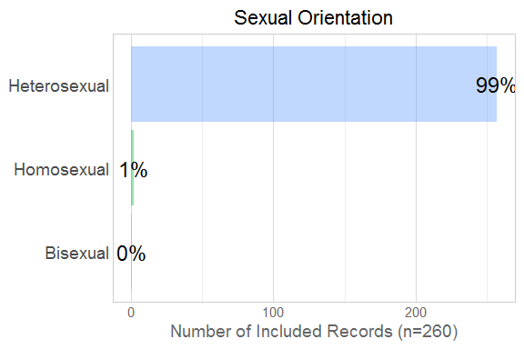
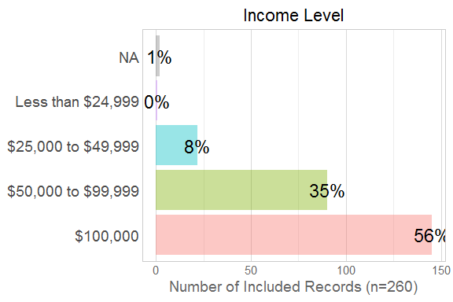
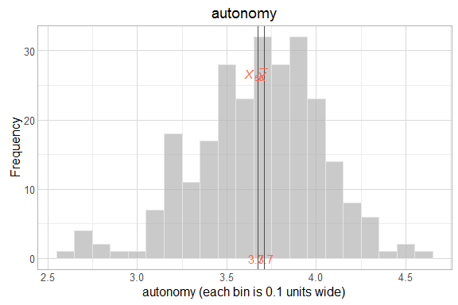
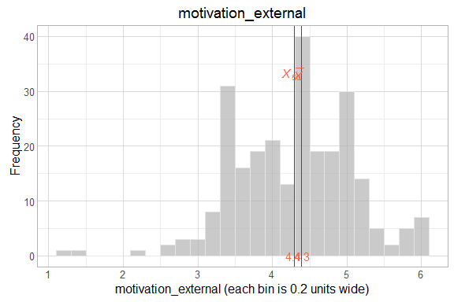

# EDA of Scales

<!--  Set the working directory to the repository's base directory; this assumes the report is nested inside of three directories.-->


<!-- Set the report-wide options, and point to the external code file. -->


<!-- Load the sources.  Suppress the output when loading sources. -->


<!-- Load 'sourced' R files.  Suppress the output when loading packages. -->


<!-- Load any global functions and variables declared in the R file.  Suppress the output. -->


<!-- Declare any global functions specific to a Rmd output.  Suppress the output. -->


<!-- Load the datasets. -->


<!-- Tweak the datasets. -->


# Summary

### Notes

### Unanswered questions


# Moments

```r
summary(ds) #Mean and quartiles
```

```
  response_id     one_child_at_least live_with_child    sexual_orientation live_with_mother is_married    
 Min.   :  9.00   Mode:logical       Min.   :1       Heterosexual:257      Mode :logical    Mode:logical  
 1st Qu.: 83.75   TRUE:260           1st Qu.:1       Homosexual  :  2      FALSE:6          TRUE:260      
 Median :184.50   NA's:0             Median :1       Bisexual    :  1      TRUE :254        NA's:0        
 Mean   :188.28                      Mean   :1                             NA's :0                        
 3rd Qu.:292.50                      3rd Qu.:1                                                            
 Max.   :404.00                      Max.   :1                                                            
                                                                                                          
    married_duration                         education            age                income_category
 0-1 year   :  2     High school diploma or GED   : 19   18-25      :  0   Less than $24,999 :  1   
 1-5 years  :  8     Vocational-Technical Training:  7   26-40      :167   $25,000 to $49,999: 22   
 6-10 years : 63     Associates Degree            : 17   41-55      : 88   $50,000 to $99,999: 90   
 11-15 years:110     College Graduate             :104   56 or older:  4   $100,000          :145   
 16-20 years: 55     Graduate School              :113   NA's       :  1   NA's              :  2   
 20+years   : 21                                                                                    
 NA's       :  1                                                                                    
 child_in_home_count              race                                      religion   work_hours_outside
 1        : 26       Black          :  4   Christian                            :225   0    :  4         
 2        :124       Caucasian      :229   Agnostic                             : 13   1-20 : 12         
 3        : 72       Asian-American :  5   None                                 : 10   21-40: 74         
 4 or more: 38       American Indian: 10   Atheist                              :  7   40+  :169         
                     Hispanic       :  4   American Indian spirituality/religion:  3   NA's :  1         
                     Other          :  7   (Other)                              :  0                     
                     NA's           :  1   NA's                                 :  2                     
 work_hours_spouse_outside section_complete_count    autonomy       competency     involvement    motivation_external
 0    :77                  Min.   :7              Min.   :2.562   Min.   :2.200   Min.   :3.577   Min.   :1.111      
 1-20 :55                  1st Qu.:7              1st Qu.:3.458   1st Qu.:4.600   1st Qu.:5.115   1st Qu.:3.667      
 21-40:74                  Median :7              Median :3.708   Median :5.000   Median :5.538   Median :4.389      
 40+  :53                  Mean   :7              Mean   :3.674   Mean   :4.887   Mean   :5.413   Mean   :4.292      
 NA's : 1                  3rd Qu.:7              3rd Qu.:3.917   3rd Qu.:5.200   3rd Qu.:5.808   3rd Qu.:4.844      
                           Max.   :7              Max.   :4.562   Max.   :6.000   Max.   :6.000   Max.   :6.000      
                                                                                                                     
 motivation_internal  relatedness     satisfaction  
 Min.   :3.667       Min.   :3.550   Min.   :1.667  
 1st Qu.:4.833       1st Qu.:4.500   1st Qu.:4.667  
 Median :5.333       Median :4.850   Median :5.000  
 Mean   :5.236       Mean   :4.813   Mean   :4.855  
 3rd Qu.:5.667       3rd Qu.:5.150   3rd Qu.:5.333  
 Max.   :6.000       Max.   :5.900   Max.   :6.000  
                                                    
```

```r
sapply(ds, sd) #Standard Deviation
```

```
Warning in var(if (is.vector(x) || is.factor(x)) x else as.double(x), na.rm = na.rm): Calling var(x) on a factor x is deprecated and will become an error.
  Use something like 'all(duplicated(x)[-1L])' to test for a constant vector.

Warning in var(if (is.vector(x) || is.factor(x)) x else as.double(x), na.rm = na.rm): Calling var(x) on a factor x is deprecated and will become an error.
  Use something like 'all(duplicated(x)[-1L])' to test for a constant vector.

Warning in var(if (is.vector(x) || is.factor(x)) x else as.double(x), na.rm = na.rm): Calling var(x) on a factor x is deprecated and will become an error.
  Use something like 'all(duplicated(x)[-1L])' to test for a constant vector.

Warning in var(if (is.vector(x) || is.factor(x)) x else as.double(x), na.rm = na.rm): Calling var(x) on a factor x is deprecated and will become an error.
  Use something like 'all(duplicated(x)[-1L])' to test for a constant vector.

Warning in var(if (is.vector(x) || is.factor(x)) x else as.double(x), na.rm = na.rm): Calling var(x) on a factor x is deprecated and will become an error.
  Use something like 'all(duplicated(x)[-1L])' to test for a constant vector.

Warning in var(if (is.vector(x) || is.factor(x)) x else as.double(x), na.rm = na.rm): Calling var(x) on a factor x is deprecated and will become an error.
  Use something like 'all(duplicated(x)[-1L])' to test for a constant vector.

Warning in var(if (is.vector(x) || is.factor(x)) x else as.double(x), na.rm = na.rm): Calling var(x) on a factor x is deprecated and will become an error.
  Use something like 'all(duplicated(x)[-1L])' to test for a constant vector.

Warning in var(if (is.vector(x) || is.factor(x)) x else as.double(x), na.rm = na.rm): Calling var(x) on a factor x is deprecated and will become an error.
  Use something like 'all(duplicated(x)[-1L])' to test for a constant vector.

Warning in var(if (is.vector(x) || is.factor(x)) x else as.double(x), na.rm = na.rm): Calling var(x) on a factor x is deprecated and will become an error.
  Use something like 'all(duplicated(x)[-1L])' to test for a constant vector.

Warning in var(if (is.vector(x) || is.factor(x)) x else as.double(x), na.rm = na.rm): Calling var(x) on a factor x is deprecated and will become an error.
  Use something like 'all(duplicated(x)[-1L])' to test for a constant vector.
```

```
              response_id        one_child_at_least           live_with_child        sexual_orientation 
              113.8689903                 0.0000000                 0.0000000                 0.1514213 
         live_with_mother                is_married          married_duration                 education 
                0.1504374                 0.0000000                        NA                 1.1229377 
                      age           income_category       child_in_home_count                      race 
                       NA                        NA                 0.8626838                        NA 
                 religion        work_hours_outside work_hours_spouse_outside    section_complete_count 
                       NA                        NA                        NA                 0.0000000 
                 autonomy                competency               involvement       motivation_external 
                0.3520898                 0.5985682                 0.4966607                 0.7868635 
      motivation_internal               relatedness              satisfaction 
                0.5738603                 0.4735373                 0.6073652 
```

```r
sapply(ds, e1071::skewness, na.rm=T) #Skew (0 signifies symmetry)
```

```
Warning in mean.default(x): argument is not numeric or logical: returning NA
```

```
Warning in Ops.factor(x, mean(x)): '-' not meaningful for factors
```

```
Warning in mean.default(x): argument is not numeric or logical: returning NA
```

```
Warning in Ops.factor(x, mean(x)): '-' not meaningful for factors
```

```
Warning in mean.default(x): argument is not numeric or logical: returning NA
```

```
Warning in Ops.factor(x, mean(x)): '-' not meaningful for factors
```

```
Warning in mean.default(x): argument is not numeric or logical: returning NA
```

```
Warning in Ops.factor(x, mean(x)): '-' not meaningful for factors
```

```
Warning in mean.default(x): argument is not numeric or logical: returning NA
```

```
Warning in Ops.factor(x, mean(x)): '-' not meaningful for factors
```

```
Warning in mean.default(x): argument is not numeric or logical: returning NA
```

```
Warning in Ops.factor(x, mean(x)): '-' not meaningful for factors
```

```
Warning in mean.default(x): argument is not numeric or logical: returning NA
```

```
Warning in Ops.factor(x, mean(x)): '-' not meaningful for factors
```

```
Warning in mean.default(x): argument is not numeric or logical: returning NA
```

```
Warning in Ops.factor(x, mean(x)): '-' not meaningful for factors
```

```
Warning in mean.default(x): argument is not numeric or logical: returning NA
```

```
Warning in Ops.factor(x, mean(x)): '-' not meaningful for factors
```

```
Warning in mean.default(x): argument is not numeric or logical: returning NA
```

```
Warning in Ops.factor(x, mean(x)): '-' not meaningful for factors
```

```
              response_id        one_child_at_least           live_with_child        sexual_orientation 
                0.1158917                       NaN                       NaN                        NA 
         live_with_mother                is_married          married_duration                 education 
               -6.3160974                       NaN                        NA                        NA 
                      age           income_category       child_in_home_count                      race 
                       NA                        NA                        NA                        NA 
                 religion        work_hours_outside work_hours_spouse_outside    section_complete_count 
                       NA                        NA                        NA                       NaN 
                 autonomy                competency               involvement       motivation_external 
               -0.3984564                -0.6541192                -1.1054107                -0.2988568 
      motivation_internal               relatedness              satisfaction 
               -0.6590821                -0.2871952                -0.8064942 
```

```r
sapply(ds, e1071::kurtosis, na.rm=T) #Kurtosis (0 signifies Gaussian-ish peakedness)
```

```
Warning in mean.default(x): argument is not numeric or logical: returning NA

Warning in mean.default(x): '-' not meaningful for factors
```

```
Warning in mean.default(x): argument is not numeric or logical: returning NA
```

```
Warning in Ops.factor(x, mean(x)): '-' not meaningful for factors
```

```
Warning in mean.default(x): argument is not numeric or logical: returning NA
```

```
Warning in Ops.factor(x, mean(x)): '-' not meaningful for factors
```

```
Warning in mean.default(x): argument is not numeric or logical: returning NA
```

```
Warning in Ops.factor(x, mean(x)): '-' not meaningful for factors
```

```
Warning in mean.default(x): argument is not numeric or logical: returning NA
```

```
Warning in Ops.factor(x, mean(x)): '-' not meaningful for factors
```

```
Warning in mean.default(x): argument is not numeric or logical: returning NA
```

```
Warning in Ops.factor(x, mean(x)): '-' not meaningful for factors
```

```
Warning in mean.default(x): argument is not numeric or logical: returning NA
```

```
Warning in Ops.factor(x, mean(x)): '-' not meaningful for factors
```

```
Warning in mean.default(x): argument is not numeric or logical: returning NA
```

```
Warning in Ops.factor(x, mean(x)): '-' not meaningful for factors
```

```
Warning in mean.default(x): argument is not numeric or logical: returning NA
```

```
Warning in Ops.factor(x, mean(x)): '-' not meaningful for factors
```

```
Warning in mean.default(x): argument is not numeric or logical: returning NA
```

```
Warning in Ops.factor(x, mean(x)): '-' not meaningful for factors
```

```
              response_id        one_child_at_least           live_with_child        sexual_orientation 
               -1.2769582                       NaN                       NaN                        NA 
         live_with_mother                is_married          married_duration                 education 
               38.0394367                       NaN                        NA                        NA 
                      age           income_category       child_in_home_count                      race 
                       NA                        NA                        NA                        NA 
                 religion        work_hours_outside work_hours_spouse_outside    section_complete_count 
                       NA                        NA                        NA                       NaN 
                 autonomy                competency               involvement       motivation_external 
                0.2626358                 1.6637468                 1.0498651                 0.7562286 
      motivation_internal               relatedness              satisfaction 
               -0.3314176                -0.3605562                 2.9667347 
```

# Marginals
<!-- --><!-- --><!-- --><!-- --><!-- --><!-- --><!-- --><!-- --><!-- --><!-- --><!-- --><!-- --><!-- --><!-- --><!-- --><!-- --><!-- --><!-- --><!-- --><!-- --><!-- --><!-- -->

# Scatterplots
<!-- --><!-- --><!-- -->

# Session Information
For the sake of documentation and reproducibility, the current report was rendered on a system using the following software.


```
Report rendered by Will at 2016-05-09, 21:19 -0500
```

```
R version 3.3.0 Patched (2016-05-05 r70588)
Platform: x86_64-w64-mingw32/x64 (64-bit)
Running under: Windows >= 8 x64 (build 9200)

locale:
[1] LC_COLLATE=English_United States.1252  LC_CTYPE=English_United States.1252    LC_MONETARY=English_United States.1252
[4] LC_NUMERIC=C                           LC_TIME=English_United States.1252    

attached base packages:
[1] stats     graphics  grDevices utils     datasets  methods   base     

other attached packages:
[1] magrittr_1.5  ggplot2_2.1.0 knitr_1.12.3 

loaded via a namespace (and not attached):
 [1] Rcpp_0.12.4                 munsell_0.4.3               colorspace_1.2-6            R6_2.1.2                   
 [5] stringr_1.0.0               plyr_1.8.3                  dplyr_0.4.3                 tools_3.3.0                
 [9] parallel_3.3.0              grid_3.3.0                  gtable_0.2.0                e1071_1.6-7                
[13] DBI_0.4-1                   class_7.3-14                htmltools_0.3.5             lazyeval_0.1.10            
[17] yaml_2.1.13                 digest_0.6.9                assertthat_0.1              readr_0.2.2                
[21] formatR_1.3                 evaluate_0.9                rmarkdown_0.9.6             labeling_0.3               
[25] stringi_1.0-1               moments_0.14                scales_0.4.0                TabularManifest_0.1-16.9000
```
