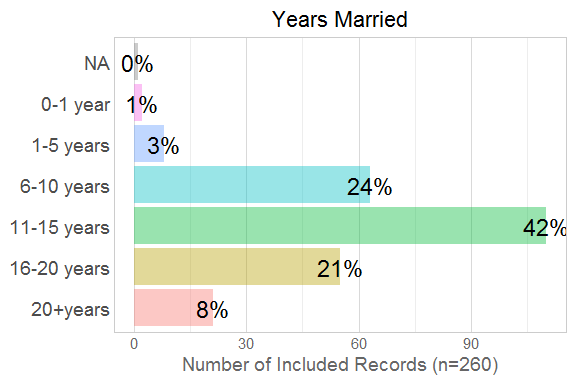
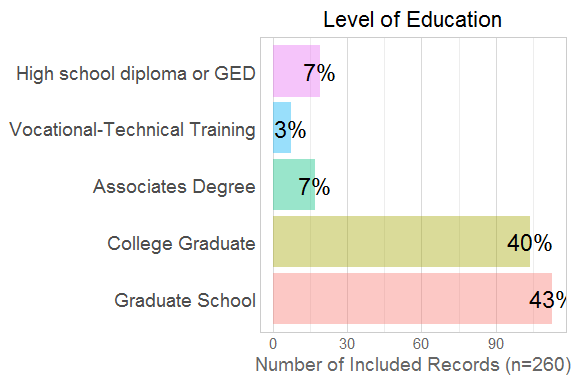
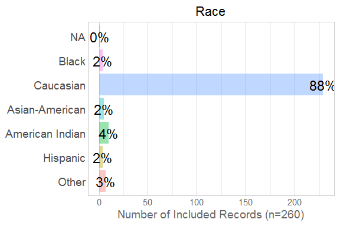
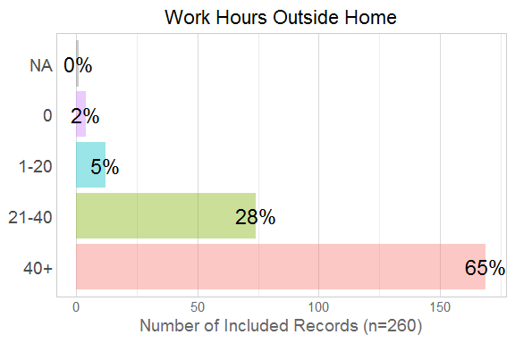
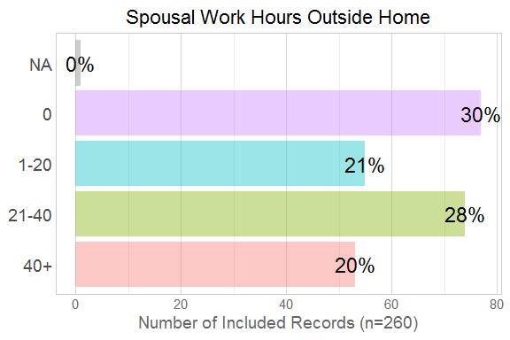
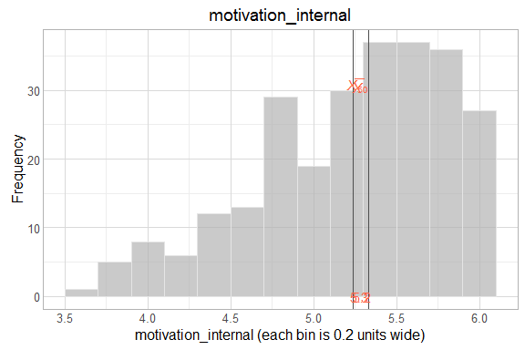

# EDA of Scales

<!--  Set the working directory to the repository's base directory; this assumes the report is nested inside of three directories.-->


<!-- Set the report-wide options, and point to the external code file. -->


<!-- Load the sources.  Suppress the output when loading sources. -->


<!-- Load 'sourced' R files.  Suppress the output when loading packages. -->


<!-- Load any global functions and variables declared in the R file.  Suppress the output. -->


<!-- Declare any global functions specific to a Rmd output.  Suppress the output. -->


<!-- Load the datasets. -->


<!-- Tweak the datasets. -->


# Summary

### Notes

### Unanswered questions


# Moments

```r
summary(ds) #Mean and quartiles
```

```
  response_id    one_child_at_least live_with_child    sexual_orientation live_with_mother is_married    
 Min.   : 22.0   Mode:logical       Min.   :1       Heterosexual:54       Mode :logical    Mode:logical  
 1st Qu.:248.5   TRUE:55            1st Qu.:1       Homosexual  : 1       FALSE:3          TRUE:55       
 Median :356.0   NA's:0             Median :1       Bisexual    : 0       TRUE :52         NA's:0        
 Mean   :320.1                      Mean   :1                             NA's :0                        
 3rd Qu.:412.5                      3rd Qu.:1                                                            
 Max.   :429.0                      Max.   :1                                                            
                                                                                                         
    married_duration                         education           age               income_category child_in_home_count
 0-1 year   : 0      High school diploma or GED   : 7   18-25      : 0   Less than $24,999 : 2     1        : 5       
 1-5 years  : 3      Vocational-Technical Training: 3   26-40      :33   $25,000 to $49,999: 3     2        :25       
 6-10 years :17      Associates Degree            : 4   41-55      :20   $50,000 to $99,999:19     3        :12       
 11-15 years:23      College Graduate             :25   56 or older: 0   $100,000          :25     4 or more:11       
 16-20 years: 9      Graduate School              :15   NA's       : 2   NA's              : 6     NA's     : 2       
 20+years   : 2      NA's                         : 1                                                                 
 NA's       : 1                                                                                                       
              race                                     religion  work_hours_outside work_hours_spouse_outside
 Black          : 0   Christian                            :42   0    : 0           0    :16                 
 Caucasian      :48   Atheist                              : 5   1-20 : 5           1-20 :11                 
 Asian-American : 1   None                                 : 4   21-40:16           21-40:19                 
 American Indian: 2   Buddhist                             : 1   40+  :34           40+  : 9                 
 Hispanic       : 1   American Indian spirituality/religion: 1                                               
 Other          : 1   (Other)                              : 1                                               
 NA's           : 2   NA's                                 : 1                                               
 section_complete_count    autonomy       competency    involvement    motivation_external motivation_internal
 Min.   :0.000          Min.   :2.479   Min.   :1.00   Min.   :2.042   Min.   :2.222       Min.   :4.875      
 1st Qu.:0.000          1st Qu.:3.391   1st Qu.:4.65   1st Qu.:3.865   1st Qu.:3.809       1st Qu.:5.031      
 Median :0.000          Median :3.656   Median :5.00   Median :5.200   Median :4.125       Median :5.257      
 Mean   :1.382          Mean   :3.600   Mean   :4.60   Mean   :4.522   Mean   :4.174       Mean   :5.336      
 3rd Qu.:2.000          3rd Qu.:4.000   3rd Qu.:5.20   3rd Qu.:5.404   3rd Qu.:4.625       3rd Qu.:5.566      
 Max.   :6.000          Max.   :4.250   Max.   :6.00   Max.   :5.875   Max.   :6.000       Max.   :6.000      
                        NA's   :35      NA's   :37     NA's   :48      NA's   :48          NA's   :49         
  relatedness     satisfaction  
 Min.   :2.550   Min.   :1.667  
 1st Qu.:4.000   1st Qu.:2.000  
 Median :4.600   Median :3.333  
 Mean   :4.327   Mean   :3.333  
 3rd Qu.:4.750   3rd Qu.:4.000  
 Max.   :5.300   Max.   :5.667  
 NA's   :42      NA's   :50     
```

```r
sapply(ds, sd) #Standard Deviation
```

```
Warning in var(if (is.vector(x) || is.factor(x)) x else as.double(x), na.rm = na.rm): Calling var(x) on a factor x is deprecated and will become an error.
  Use something like 'all(duplicated(x)[-1L])' to test for a constant vector.

Warning in var(if (is.vector(x) || is.factor(x)) x else as.double(x), na.rm = na.rm): Calling var(x) on a factor x is deprecated and will become an error.
  Use something like 'all(duplicated(x)[-1L])' to test for a constant vector.

Warning in var(if (is.vector(x) || is.factor(x)) x else as.double(x), na.rm = na.rm): Calling var(x) on a factor x is deprecated and will become an error.
  Use something like 'all(duplicated(x)[-1L])' to test for a constant vector.

Warning in var(if (is.vector(x) || is.factor(x)) x else as.double(x), na.rm = na.rm): Calling var(x) on a factor x is deprecated and will become an error.
  Use something like 'all(duplicated(x)[-1L])' to test for a constant vector.

Warning in var(if (is.vector(x) || is.factor(x)) x else as.double(x), na.rm = na.rm): Calling var(x) on a factor x is deprecated and will become an error.
  Use something like 'all(duplicated(x)[-1L])' to test for a constant vector.

Warning in var(if (is.vector(x) || is.factor(x)) x else as.double(x), na.rm = na.rm): Calling var(x) on a factor x is deprecated and will become an error.
  Use something like 'all(duplicated(x)[-1L])' to test for a constant vector.

Warning in var(if (is.vector(x) || is.factor(x)) x else as.double(x), na.rm = na.rm): Calling var(x) on a factor x is deprecated and will become an error.
  Use something like 'all(duplicated(x)[-1L])' to test for a constant vector.

Warning in var(if (is.vector(x) || is.factor(x)) x else as.double(x), na.rm = na.rm): Calling var(x) on a factor x is deprecated and will become an error.
  Use something like 'all(duplicated(x)[-1L])' to test for a constant vector.

Warning in var(if (is.vector(x) || is.factor(x)) x else as.double(x), na.rm = na.rm): Calling var(x) on a factor x is deprecated and will become an error.
  Use something like 'all(duplicated(x)[-1L])' to test for a constant vector.

Warning in var(if (is.vector(x) || is.factor(x)) x else as.double(x), na.rm = na.rm): Calling var(x) on a factor x is deprecated and will become an error.
  Use something like 'all(duplicated(x)[-1L])' to test for a constant vector.
```

```
              response_id        one_child_at_least           live_with_child        sexual_orientation 
              113.1435369                 0.0000000                 0.0000000                 0.1348400 
         live_with_mother                is_married          married_duration                 education 
                0.2291839                 0.0000000                        NA                        NA 
                      age           income_category       child_in_home_count                      race 
                       NA                        NA                        NA                        NA 
                 religion        work_hours_outside work_hours_spouse_outside    section_complete_count 
                       NA                 0.6626139                 1.0799676                 2.0771322 
                 autonomy                competency               involvement       motivation_external 
                       NA                        NA                        NA                        NA 
      motivation_internal               relatedness              satisfaction 
                       NA                        NA                        NA 
```

```r
sapply(ds, e1071::skewness, na.rm=T) #Skew (0 signifies symmetry)
```

```
Warning in mean.default(x): argument is not numeric or logical: returning NA
```

```
Warning in Ops.factor(x, mean(x)): '-' not meaningful for factors
```

```
Warning in mean.default(x): argument is not numeric or logical: returning NA
```

```
Warning in Ops.factor(x, mean(x)): '-' not meaningful for factors
```

```
Warning in mean.default(x): argument is not numeric or logical: returning NA
```

```
Warning in Ops.factor(x, mean(x)): '-' not meaningful for factors
```

```
Warning in mean.default(x): argument is not numeric or logical: returning NA
```

```
Warning in Ops.factor(x, mean(x)): '-' not meaningful for factors
```

```
Warning in mean.default(x): argument is not numeric or logical: returning NA
```

```
Warning in Ops.factor(x, mean(x)): '-' not meaningful for factors
```

```
Warning in mean.default(x): argument is not numeric or logical: returning NA
```

```
Warning in Ops.factor(x, mean(x)): '-' not meaningful for factors
```

```
Warning in mean.default(x): argument is not numeric or logical: returning NA
```

```
Warning in Ops.factor(x, mean(x)): '-' not meaningful for factors
```

```
Warning in mean.default(x): argument is not numeric or logical: returning NA
```

```
Warning in Ops.factor(x, mean(x)): '-' not meaningful for factors
```

```
Warning in mean.default(x): argument is not numeric or logical: returning NA
```

```
Warning in Ops.factor(x, mean(x)): '-' not meaningful for factors
```

```
Warning in mean.default(x): argument is not numeric or logical: returning NA
```

```
Warning in Ops.factor(x, mean(x)): '-' not meaningful for factors
```

```
              response_id        one_child_at_least           live_with_child        sexual_orientation 
              -1.00091956                       NaN                       NaN                        NA 
         live_with_mother                is_married          married_duration                 education 
              -3.81663287                       NaN                        NA                        NA 
                      age           income_category       child_in_home_count                      race 
                       NA                        NA                        NA                        NA 
                 religion        work_hours_outside work_hours_spouse_outside    section_complete_count 
                       NA                        NA                        NA                1.10179161 
                 autonomy                competency               involvement       motivation_external 
              -0.70398385               -1.68267324               -0.67606344               -0.08993981 
      motivation_internal               relatedness              satisfaction 
               0.37867615               -1.03627610                0.28440892 
```

```r
sapply(ds, e1071::kurtosis, na.rm=T) #Kurtosis (0 signifies Gaussian-ish peakedness)
```

```
Warning in mean.default(x): argument is not numeric or logical: returning NA

Warning in mean.default(x): '-' not meaningful for factors
```

```
Warning in mean.default(x): argument is not numeric or logical: returning NA
```

```
Warning in Ops.factor(x, mean(x)): '-' not meaningful for factors
```

```
Warning in mean.default(x): argument is not numeric or logical: returning NA
```

```
Warning in Ops.factor(x, mean(x)): '-' not meaningful for factors
```

```
Warning in mean.default(x): argument is not numeric or logical: returning NA
```

```
Warning in Ops.factor(x, mean(x)): '-' not meaningful for factors
```

```
Warning in mean.default(x): argument is not numeric or logical: returning NA
```

```
Warning in Ops.factor(x, mean(x)): '-' not meaningful for factors
```

```
Warning in mean.default(x): argument is not numeric or logical: returning NA
```

```
Warning in Ops.factor(x, mean(x)): '-' not meaningful for factors
```

```
Warning in mean.default(x): argument is not numeric or logical: returning NA
```

```
Warning in Ops.factor(x, mean(x)): '-' not meaningful for factors
```

```
Warning in mean.default(x): argument is not numeric or logical: returning NA
```

```
Warning in Ops.factor(x, mean(x)): '-' not meaningful for factors
```

```
Warning in mean.default(x): argument is not numeric or logical: returning NA
```

```
Warning in Ops.factor(x, mean(x)): '-' not meaningful for factors
```

```
Warning in mean.default(x): argument is not numeric or logical: returning NA
```

```
Warning in Ops.factor(x, mean(x)): '-' not meaningful for factors
```

```
              response_id        one_child_at_least           live_with_child        sexual_orientation 
               -0.3039642                       NaN                       NaN                        NA 
         live_with_mother                is_married          married_duration                 education 
               12.8004069                       NaN                        NA                        NA 
                      age           income_category       child_in_home_count                      race 
                       NA                        NA                        NA                        NA 
                 religion        work_hours_outside work_hours_spouse_outside    section_complete_count 
                       NA                        NA                        NA                -0.4696217 
                 autonomy                competency               involvement       motivation_external 
               -0.3784779                 2.0286265                -1.1343305                -1.0072162 
      motivation_internal               relatedness              satisfaction 
               -1.6462382                 0.5136431                -1.8056134 
```

# Marginals
<!-- --><!-- --><!-- --><!-- --><!-- --><!-- --><!-- --><!-- --><!-- --><!-- --><!-- --><!-- --><!-- --><!-- --><!-- --><!-- --><!-- --><!-- --><!-- --><!-- --><!-- --><!-- -->

# Scatterplots
<!-- --><!-- --><!-- -->

# Session Information
For the sake of documentation and reproducibility, the current report was rendered on a system using the following software.


```
Report rendered by Will at 2016-05-09, 21:08 -0500
```

```
R version 3.3.0 Patched (2016-05-05 r70588)
Platform: x86_64-w64-mingw32/x64 (64-bit)
Running under: Windows >= 8 x64 (build 9200)

locale:
[1] LC_COLLATE=English_United States.1252  LC_CTYPE=English_United States.1252    LC_MONETARY=English_United States.1252
[4] LC_NUMERIC=C                           LC_TIME=English_United States.1252    

attached base packages:
[1] stats     graphics  grDevices utils     datasets  methods   base     

other attached packages:
[1] magrittr_1.5  ggplot2_2.1.0 knitr_1.12.3 

loaded via a namespace (and not attached):
 [1] Rcpp_0.12.4                 munsell_0.4.3               colorspace_1.2-6            R6_2.1.2                   
 [5] stringr_1.0.0               plyr_1.8.3                  dplyr_0.4.3                 tools_3.3.0                
 [9] parallel_3.3.0              grid_3.3.0                  gtable_0.2.0                e1071_1.6-7                
[13] DBI_0.4-1                   class_7.3-14                htmltools_0.3.5             lazyeval_0.1.10            
[17] yaml_2.1.13                 digest_0.6.9                assertthat_0.1              readr_0.2.2                
[21] formatR_1.3                 evaluate_0.9                rmarkdown_0.9.6             labeling_0.3               
[25] stringi_1.0-1               moments_0.14                scales_0.4.0                TabularManifest_0.1-16.9000
```
