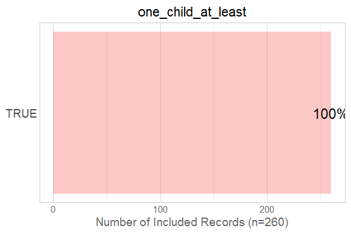
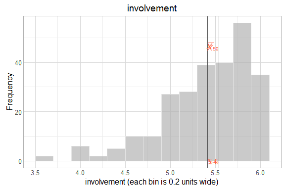
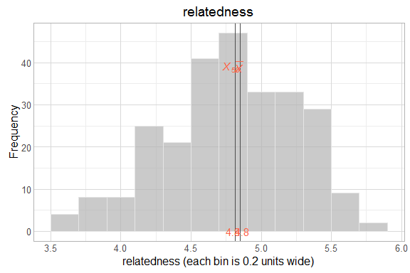

# EDA of Scales

<!--  Set the working directory to the repository's base directory; this assumes the report is nested inside of three directories.-->


<!-- Set the report-wide options, and point to the external code file. -->


<!-- Load the sources.  Suppress the output when loading sources. -->


<!-- Load 'sourced' R files.  Suppress the output when loading packages. -->


<!-- Load any global functions and variables declared in the R file.  Suppress the output. -->


<!-- Declare any global functions specific to a Rmd output.  Suppress the output. -->


<!-- Load the datasets. -->


<!-- Tweak the datasets. -->


# Summary

### Notes

### Unanswered questions


# Marginals


# Scatterplots


# Session Information
For the sake of documentation and reproducibility, the current report was rendered on a system using the following software.


```
Report rendered by Will at 2016-04-13, 21:55 -0500
```

```
R version 3.2.4 Patched (2016-03-28 r70435)
Platform: x86_64-w64-mingw32/x64 (64-bit)
Running under: Windows >= 8 x64 (build 9200)

locale:
[1] LC_COLLATE=English_United States.1252  LC_CTYPE=English_United States.1252    LC_MONETARY=English_United States.1252
[4] LC_NUMERIC=C                           LC_TIME=English_United States.1252    

attached base packages:
[1] stats     graphics  grDevices utils     datasets  methods   base     

other attached packages:
[1] magrittr_1.5  ggplot2_2.1.0 knitr_1.12.3 

loaded via a namespace (and not attached):
 [1] Rcpp_0.12.4                 munsell_0.4.3               colorspace_1.2-6            R6_2.1.2                   
 [5] stringr_1.0.0               plyr_1.8.3                  dplyr_0.4.3                 tools_3.2.4                
 [9] parallel_3.2.4              grid_3.2.4                  gtable_0.2.0                DBI_0.3.1.9008             
[13] htmltools_0.3.5             yaml_2.1.13                 lazyeval_0.1.10             digest_0.6.9               
[17] assertthat_0.1              readr_0.2.2                 formatR_1.3                 evaluate_0.8.3             
[21] rmarkdown_0.9.5             labeling_0.3                stringi_1.0-1               scales_0.4.0               
[25] TabularManifest_0.1-16.9000
```
