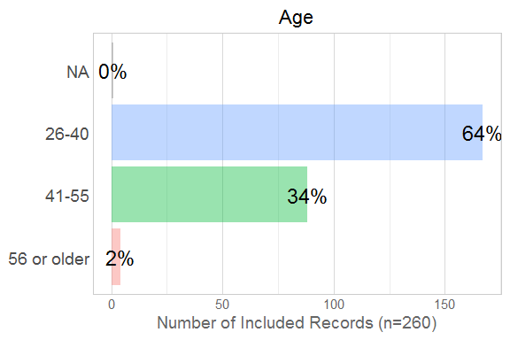

# EDA of Scales

<!--  Set the working directory to the repository's base directory; this assumes the report is nested inside of three directories.-->

<!-- Set the report-wide options, and point to the external code file. -->

<!-- Load the sources.  Suppress the output when loading sources. -->

<!-- Load 'sourced' R files.  Suppress the output when loading packages. -->

<!-- Load any global functions and variables declared in the R file.  Suppress the output. -->

<!-- Declare any global functions specific to a Rmd output.  Suppress the output. -->

<!-- Load the datasets. -->

<!-- Tweak the datasets. -->

# Summary

### Notes

### Unanswered questions

# Marginals

